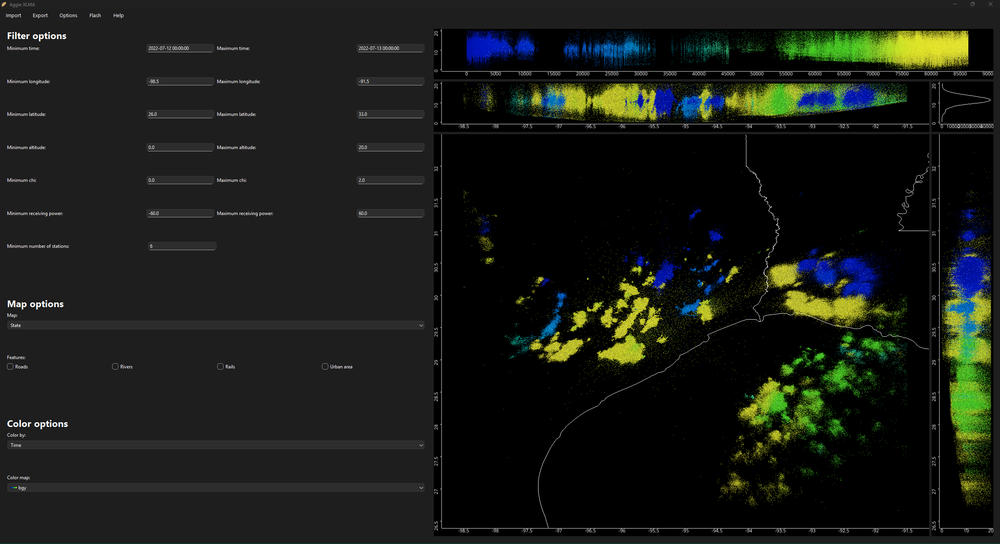

A Python-based application that helps you view, analyze and interact with LMA ([Lightning Mapping Array](https://agupubs.onlinelibrary.wiley.com/doi/10.1029/2004JD004549)) data. This is not an [alternative](https://github.com/deeplycloudy/xlma-python?tab=readme-ov-file) to the [IDL](https://www.nv5geospatialsoftware.com/Products/IDL) based [XLMA](http://www.lightning.nmt.edu/nmt_lms/steps_2000/more_rt.html) software.

Features:

1. GUI based: with heavy inspiration from XLMA we offer a GUI heavily influenced by feedback from LMA scientists.
   
2. Color options: we offer the ability to color by time, latitude, longitude, altitude, chi squared value, and receiving power. We use [colorcet's](https://colorcet.holoviz.org/user_guide/Continuous.html#linear-sequential-colormaps-for-plotting-magnitudes) linear, perceptually uniform colormaps.
3. Maps: we offer state, county, NOAA county warning and the 116 congressional district maps.
4. Map features: we offer the ability to view roads, rivers, rails and urban areas in the plan view image.

Advantages:

1. Responsiveness: unlike XLMA, we utilize [PyQT](https://pypi.org/project/PyQt6/) for the GUI and rely on the QThread module to keep the UI responsive at all times.
2. Performance: we also utilize [concurrent](https://docs.python.org/3/library/concurrent.futures.html) library, to perform reading and rendering tasks in parallel. For the images, we utilize the powerful capabilities of the [datashader](https://datashader.org/) library to render images quickly.

Disadvantes:

1. Limited features: we do not offer nor seek to compete with the rich features of XLMA or Py-XLMA. Our mission is to perform the most used task of viewing, selection and extracting flash information reliably and quickly with a modern, responsive UI.

Contact:

If you would like to contribute please reach out to [Dr.Timothy Logan](https://artsci.tamu.edu/atmos-science/contact/profiles/timothy-logan.html).
